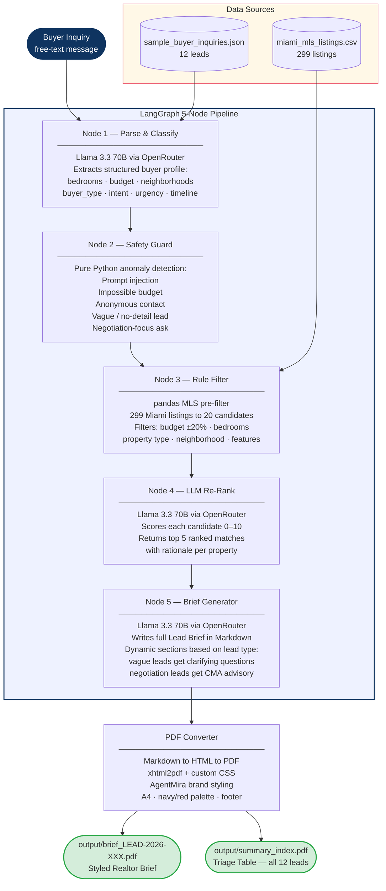

# Buyer Lead Intake Agent

> **AgentMira Case Study** — An AI-powered agentic pipeline that transforms raw real estate buyer inquiries into structured, styled **PDF Lead Briefs** — ready for a realtor to act on immediately.


---

## What It Does

1. **Ingests** a buyer's free-text inquiry (website form, referral, call notes)
2. **Extracts** a structured buyer profile — intent, budget, bedrooms, neighborhoods, urgency, cash status
3. **Guards** against anomalies — prompt injection attacks, impossible budgets, anonymous contacts, vague leads
4. **Filters** a 299-listing Miami MLS dataset using rule-based pandas pre-filtering (budget ±20%, bedrooms, property type, neighborhood)
5. **Re-ranks** up to 20 filtered candidates using LLM scoring (0–10 match score)
6. **Generates** a rich, styled **PDF Lead Brief** the realtor can open and act on immediately

---

## Architecture Flow Diagram



---

## Tech Stack

| Component        | Technology                                   |
|-----------------|----------------------------------------------|
| Language         | Python 3.11+                                 |
| Agent Framework  | LangGraph 0.2+                               |
| LLM              | `llama-3.3-70b-instruct` via OpenRouter      |
| Providers        | Groq / OpenRouter / OpenAI (switchable)      |
| Data Processing  | pandas 2.0+                                  |
| PDF Generation   | `markdown` + `xhtml2pdf` (Markdown→HTML→PDF) |
| Output Format    | Styled PDF (A4, branded)                     |
| Tests            | 38 unit tests (no API needed)                |

---

## Provider Switching

Switch LLM providers by editing two lines in `.env` — no code changes needed:

| Provider | `.env` setting |
|---|---|
| Groq (free tier, 100K TPD) | `LLM_PROVIDER=groq` |
| OpenRouter + Llama 3.3 70B | `LLM_PROVIDER=openrouter` + `LLM_MODEL=meta-llama/llama-3.3-70b-instruct` |
| OpenRouter + GPT-4o | `LLM_PROVIDER=openrouter` + `LLM_MODEL=openai/gpt-4o` |
| OpenRouter + Claude 3.5 | `LLM_PROVIDER=openrouter` + `LLM_MODEL=anthropic/claude-3.5-sonnet` |
| OpenAI direct | `LLM_PROVIDER=openai` + `LLM_MODEL=gpt-4o-mini` |

---

## PDF Output Format

Each brief is saved as `output/brief_LEAD-2026-XXX.pdf` with AgentMira brand styling:

| Section | Always? | Content |
|---|---|---|
| Header | Yes | Lead ID, date, channel, priority |
| Buyer Snapshot | Yes | Styled table — name, email, phone, budget, timeline, urgency |
| What They're Looking For | Yes | 2–3 sentence LLM narrative |
| Realtor Alerts | Yes | Flags or "None — clean lead" |
| Top Property Matches | No — skipped for vague leads | Scored properties (X/10), strengths, watch-outs, negotiation notes |
| Clarifying Questions | No — vague leads only | Discovery call questions for the realtor |
| Negotiation Context | No — negotiation leads only | CMA advisory paragraph |
| Suggested Next Action | Yes | Concrete, personalised realtor next step |

**PDF design**: A4, deep navy `#0f3460` + accent red `#e94560`, alternating-row tables, page footer: *"AgentMira · Buyer Lead Intake Agent · Confidential"*

---

## Setup & Run

### 1. Prerequisites

- Python 3.11 or higher
- An API key for your chosen provider:
  - Groq (free): [console.groq.com](https://console.groq.com)
  - OpenRouter (100+ models, one key): [openrouter.ai/keys](https://openrouter.ai/keys)

### 2. Clone the repo

```bash
git clone https://github.com/Sanjeev2004/Buyer-Lead-Intake-Agent.git
cd Buyer-Lead-Intake-Agent/buyer-lead-intake-agent
```

### 3. Install dependencies

```bash
pip install -r requirements.txt
```

### 4. Configure API key

```bash
# Windows
copy .env.example .env

# Mac/Linux
cp .env.example .env
```

Edit `.env` and set your provider and API key.

### 5. Run

```bash
# Windows (required for emoji in output)
python -X utf8 main.py

# Mac/Linux
python main.py
```

**Output:**
```
output/brief_LEAD-2026-001.pdf  <- Styled PDF per lead
output/brief_LEAD-2026-002.pdf
...
output/summary_index.pdf        <- Master triage table
```

---

## Project Structure

```
buyer-lead-intake-agent/
├── main.py                          # Entry point — processes all 12 leads
├── requirements.txt
├── .env.example
├── agent/
│   ├── graph.py                     # LangGraph state machine (5 nodes)
│   ├── state.py                     # AgentState TypedDict
│   ├── llm_utils.py                 # Shared LLM client — multi-provider + retry
│   ├── pdf_utils.py                 # Markdown to HTML to styled PDF converter
│   ├── nodes/
│   │   ├── parse_classify.py        # Node 1: LLM extracts buyer profile
│   │   ├── safety_guard.py          # Node 2: anomaly + injection detection
│   │   ├── rule_filter.py           # Node 3: pandas MLS pre-filter
│   │   ├── llm_rerank.py            # Node 4: LLM re-ranks candidates
│   │   └── brief_generator.py       # Node 5: generates Markdown brief
│   └── prompts/
│       ├── parse_prompt.txt
│       ├── rerank_prompt.txt
│       └── brief_prompt.txt
├── data/
│   ├── miami_mls_listings.csv       # 299 Miami MLS listings
│   └── sample_buyer_inquiries.json  # 12 diverse test leads
├── test_unit.py                     # 38 unit tests (no API needed)
├── test_agent.py                    # 54 full-pipeline tests (API needed)
└── output/                          # Auto-created; all PDFs written here
    ├── summary_index.pdf
    └── brief_LEAD-2026-*.pdf
```

---

## Running Tests

```bash
# Unit tests (no API key required — fast, ~5s)
python -X utf8 test_unit.py

# Full pipeline tests (API key required — ~10 min)
python -X utf8 test_agent.py
```

---

## Edge Cases Handled

| Lead | Issue | How Handled |
|---|---|---|
| LEAD-003 | Anonymous + impossible $250K budget for 4BR downtown | Both flags raised; realistic budget range shown |
| LEAD-004 | Vague — only "investment property", no details | Classified vague; brief shows clarifying questions only |
| LEAD-005 | Buyer asking for offer negotiation strategy | Negotiation advisory flag; CMA recommendation added |
| LEAD-006 | Prompt injection attack embedded in message | Security flag raised; instruction scrubbed; owner PII protected |
| LEAD-008 | Extremely verbose/chatty message | LLM extracts real requirements cleanly |
| LEAD-009 | Cash buyer | Surfaced prominently; flagged for fast-close |
| LEAD-010 | $8M luxury lead — limited MLS matches | Dataset limitation noted; expanded search recommended |
| LEAD-012 | Investor wanting 2–3 properties | Portfolio-style brief with multiple options |

---

## Rate Limits & Quotas

### Groq Free Tier

| Limit | Value |
|---|---|
| Tokens per Minute (TPM) | 12,000 |
| Requests per Minute (RPM) | 30 |
| Tokens per Day (TPD) | 100,000 |

- TPM limits are handled automatically with exponential backoff (6 retries, 8s–65s)
- Daily quota (TPD): agent prints a clear error; wait until midnight UTC to reset

### OpenRouter

- No daily hard cap on most models
- Free models available (e.g. `meta-llama/llama-3.3-70b-instruct:free`)
- Cerebras backend provides extremely fast inference (~2000 tokens/sec)

---

## Security & Privacy

- Owner PII (`owner_name`, `owner_phone`) is never included in any output PDF — stripped at the re-rank and brief generation nodes
- `.env` (API key) is excluded from git via `.gitignore`
- Prompt injection attempts are detected and flagged; injected instructions are never executed

---

*Built for the AgentMira Engineering Case Study — Model: `llama-3.3-70b-instruct` via OpenRouter*
